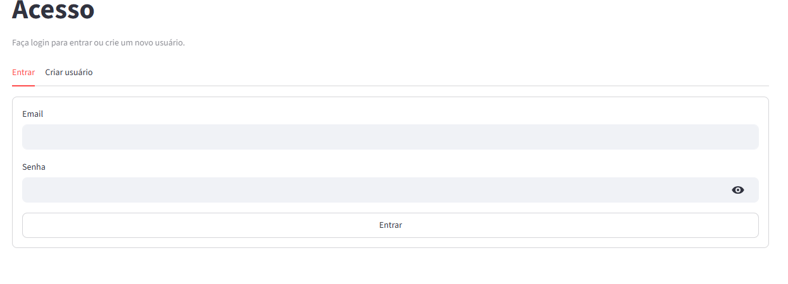
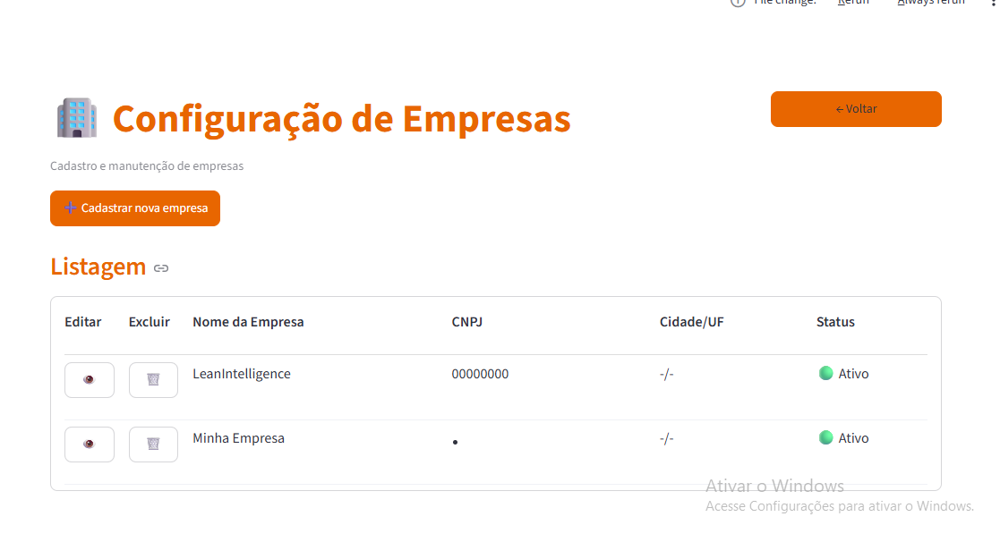
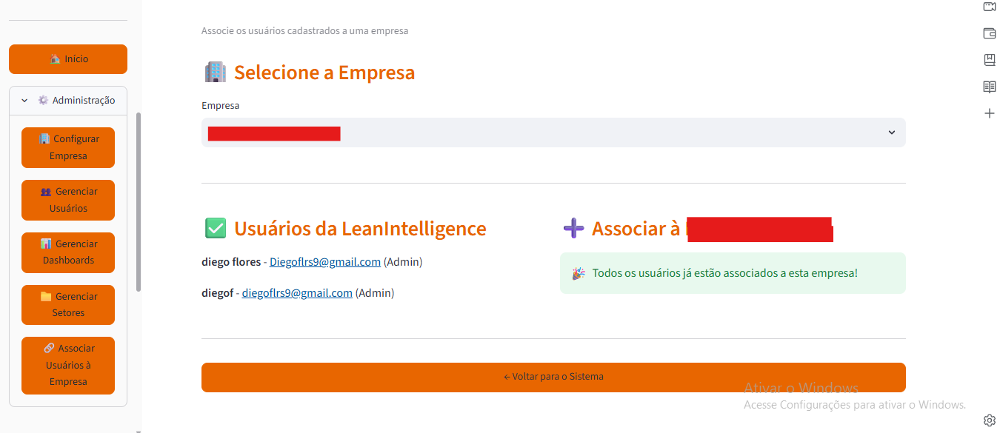
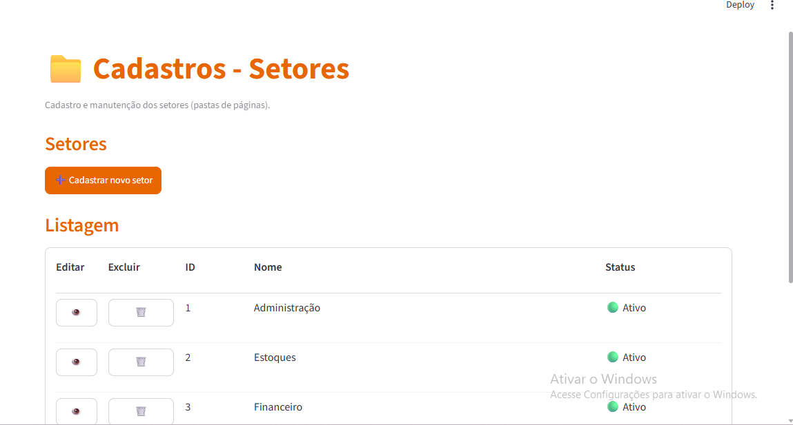
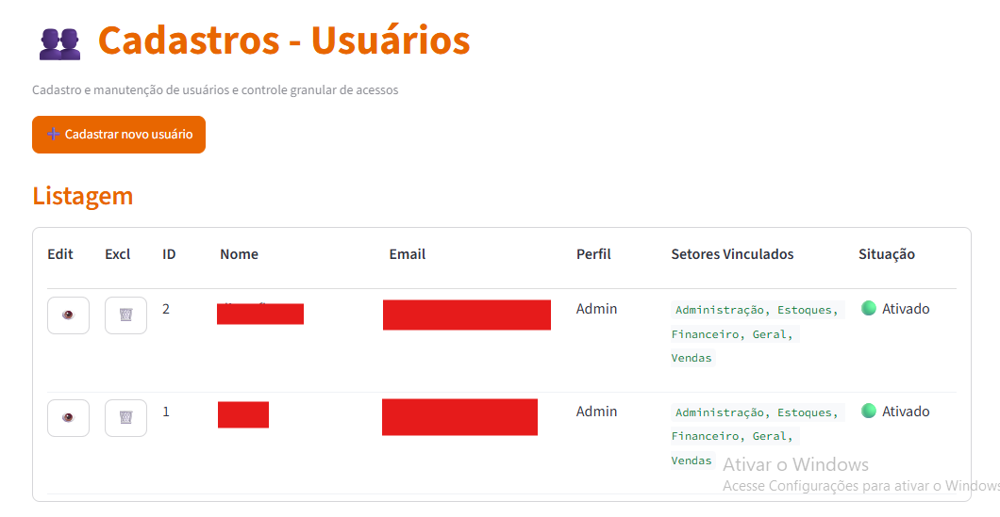
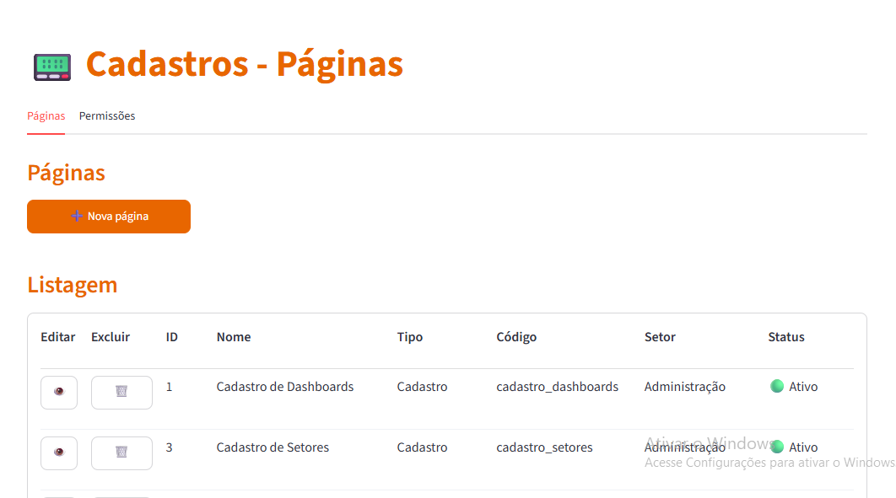
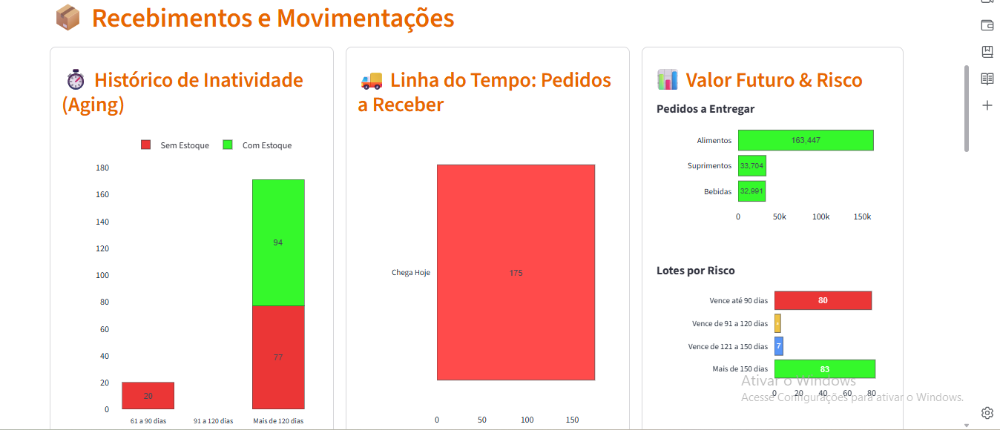
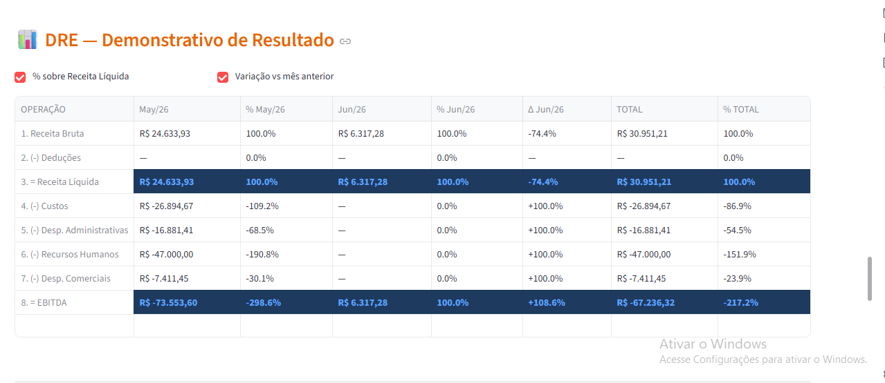
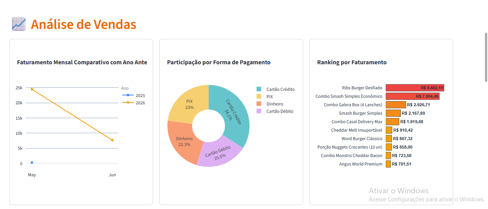

# Streamlit Dashboard Hub

Este projeto tem como intuito compartilhar dashboards com os setores e usuários de acordo com os setores que esses usuários pertencem, facilitando o compartilhamento sem precisar de um link público. A ideia é permitir que qualquer desenvolvedor possa criar o seu próprio dashboard utilizando o ecossistema Python (Pandas, Plotly, Polars, NumPy, etc.), garantindo que a informação chegue de forma clara, organizada e segura para cada área da empresa.

## Segurança e Acesso
O acesso é totalmente restrito. O dashboard é atrelado ao setor e ao usuário: se o usuário não pertencer ao setor, ele não visualiza as informações.

### Login


### Cadastro de Empresa


### Cadastro de Empresa / Funcionario


### Cadastro de Setores



### Cadastro de Usuários


### Cadastro de Dashboards


### Dashboards de Estoque com Dados de exemplo


### Dashboards de Financeiro com Dados de exemplo


### Dashboards de Vendas com Dados de exemplo


## Organização e Desenvolvimento
* **ETL em Notebooks:** O processo de ETL (Extração, Transformação e Carga) é realizado em arquivos separados (notebooks), tornando o tratamento de dados mais modular e fácil de manter.
* **Estrutura de Dashboards:** Toda a visualização fica dentro de views/pages/. Cada subpasta representa um setor específico (ex: views/pages/dashboard/), onde ficam os dashboards cadastrados internamente no sistema.
* **Qualidade e Testes:** O projeto foi desenvolvido com foco em qualidade, possuindo testes automatizados implementados com Pytest.
* **Deploy e Ambiente:** Para garantir reprodutibilidade e facilitar a implantação, o projeto conta com suporte a Docker, permitindo que toda a aplicação seja executada dentro de um container (veja [DEPLOY_DEVELOP.md](DEPLOY_DEVELOP.md)).

## Como Executar

### Local (sem Docker)

1. Clone o repositório: `git clone https://github.com/DiegoFlores96/streamlit-reports.git`
2. Entre na pasta: `cd streamlit-reports`
3. Crie o ambiente virtual e ative-o:

   ```powershell
   python -m venv .venv
   .venv\Scripts\activate
   ```

4. Instale as dependências: `pip install -r requirements.txt`
5. Copie o arquivo de variáveis de ambiente de exemplo e ajuste os valores (segredo JWT, caminho dos dados, etc.):

   ```powershell
   Copy-Item .env.develop.example .env
   ```

6. Inicie a aplicação: `streamlit run main.py`
7. Acesse em `http://localhost:8501`

### Com Docker

Veja o guia completo em [DEPLOY_DEVELOP.md](DEPLOY_DEVELOP.md). Resumo:

```powershell
Copy-Item .env.develop.example .env.develop
docker compose -f docker-compose.develop.yml up --build -d
```

## Estrutura do Projeto

- `main.py`: Ponto de entrada da aplicação Streamlit.
- `notebooks/`: Scripts para processamento de dados (ETL).
- `views/pages/`: Páginas e dashboards organizados por setor (login, cadastros, dashboard, admin).
- `controller/`, `model/`, `db/`: Camadas de regra de negócio, modelos e acesso a dados.
- `helpers/`, `middleware/`, `utils/`: Utilitários, autenticação/JWT e funções auxiliares.
- `assets/`: CSS/JS injetados na interface.
- `screenshots/`: Imagens do sistema usadas neste README.
- `tests/`: Suite de testes automatizados com Pytest.
- `Dockerfile` / `docker-compose.develop.yml`: Configuração para conteinerização da aplicação.
